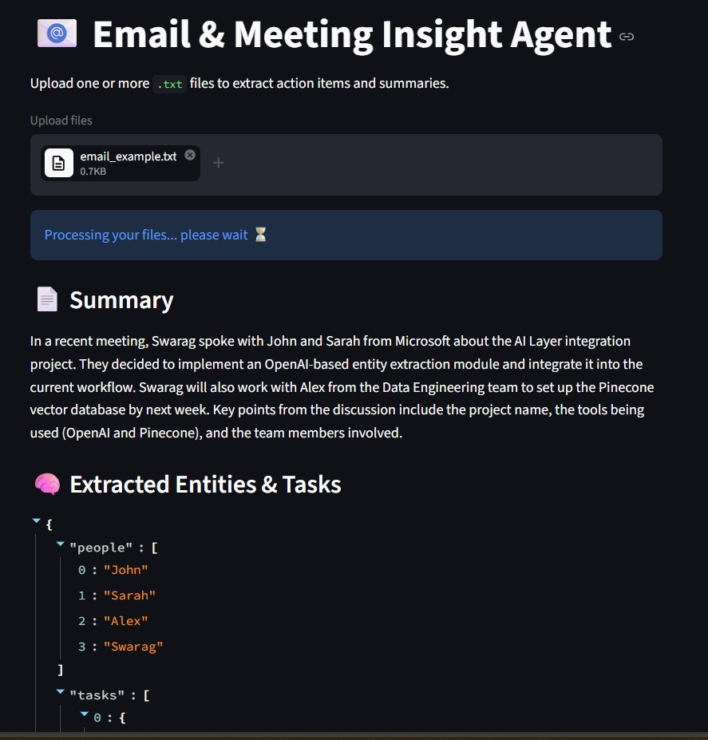
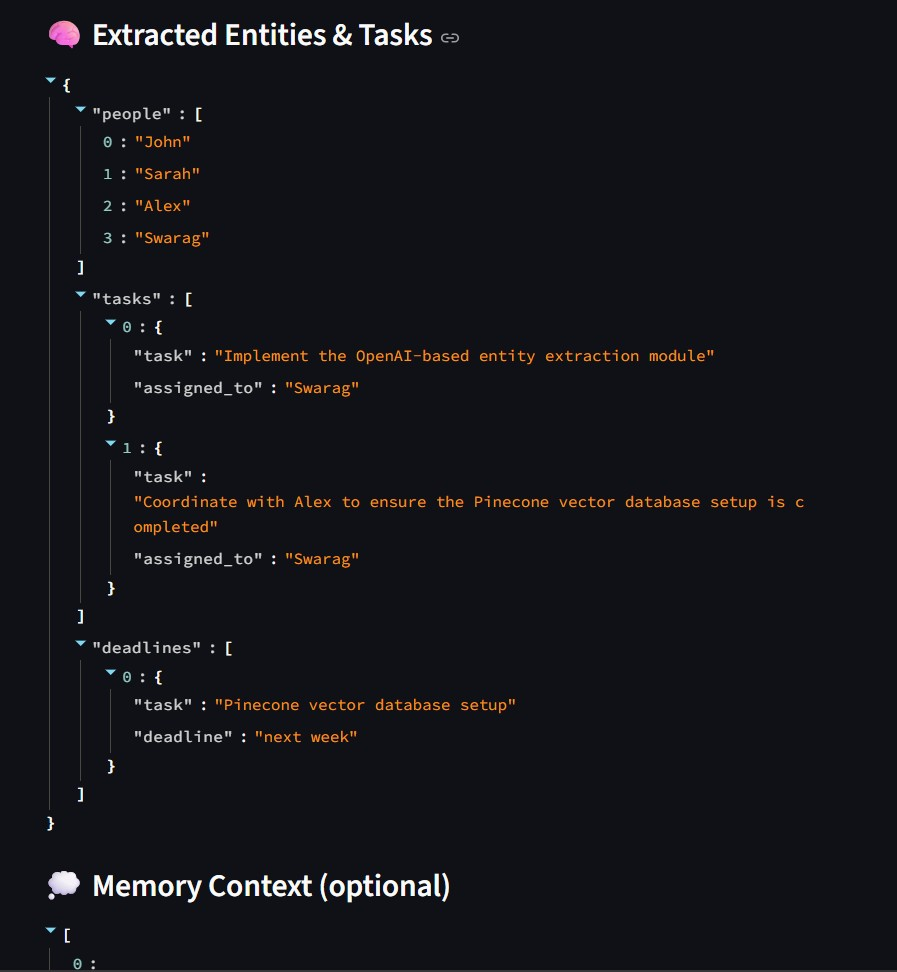
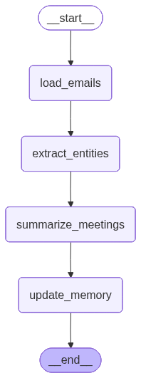

# Email & Meeting Insight Agent


An AI-powered agent that transforms unstructured email and meeting notes into structured summaries, tasks, and deadlines using LangGraph workflows.

---

## 📸 Demo / UI Preview

### 🔹 Summary View



### 🔹 Extracted Entities & Tasks



---

## 🧩 Workflow Architecture



The system follows a structured agent workflow:

- **Load Emails** → Read uploaded `.txt` files
- **Extract Entities** → Identify people, tasks, and deadlines
- **Summarize Meetings** → Generate concise summaries
- **Update Memory** → Store context for future use

### 🧠 Agent Workflow

This application uses a LangGraph-based workflow to process emails step-by-step.  
Each node represents a stage in the pipeline, enabling modular and scalable AI processing.

---

## Overview

This project is a lightweight email and meeting analysis tool built with Python, Streamlit, LangChain, and LangGraph. It helps turn unstructured text into clear action items and summaries.

---

## Why This Project?

This project demonstrates how to build a modular AI agent using LangGraph, combining LLM reasoning with structured workflows to process real-world unstructured data like emails.

---

## Key Highlights

- Built a multi-step AI agent workflow using LangGraph
- Designed structured extraction pipeline for entities and tasks
- Implemented LLM-powered summarization using OpenAI
- Developed an interactive UI using Streamlit

---

## Features

- Upload one or more `.txt` files containing email content
- Generate a clean summary of discussions
- Extract:
  - People involved
  - Tasks or responsibilities
  - Deadlines or dates
- Maintain contextual memory across the workflow
- Interactive UI built with Streamlit

---

## Tech Stack

- Python
- Streamlit
- LangChain
- LangGraph
- OpenAI GPT-4o-mini (LLM for summarization and extraction)
- JSON-based structured output

---

## Project Structure

```bash
EMAIL_INSIGHT_AGENT/
│
├── agent/
│   ├── nodes.py
│   ├── state.py
│   ├── utils.py
│   └── workflow.py
│
├── app.py
├── requirements.txt
├── visualize_graph.py
├── assets/
│   ├── UI-1.jpg
│   ├── UI-2.jpg
│   └── workflow_diagram.png
```

---

## Setup Instructions

### 1. Clone the repository

```bash
git clone https://github.com/your-username/email-insight-agent.git
cd email-insight-agent
```

---

### 2. Create and activate a virtual environment

#### Windows

```bash
python -m venv venv
venv\Scripts\activate
```

#### Mac/Linux

```bash
python3 -m venv venv
source venv/bin/activate
```

---

### 3. Install dependencies

```bash
pip install -r requirements.txt
```

---

### 4. Create a `.env` file

Create a `.env` file in the project root and add:

```env
OPENAI_API_KEY=your_openai_api_key_here
```

> ⚠️ Do not commit your `.env` file or API keys to GitHub.

---

## Run the App

Start the Streamlit app:

```bash
streamlit run app.py
```

Open in browser:

```bash
http://localhost:8501
```

---

## Input Format

Upload `.txt` files containing email content or meeting notes.

### Example:

```txt
Hi John,

It was great speaking with you and Sarah from Microsoft during yesterday’s meeting regarding the AI Layer integration project.

As discussed, we will proceed with implementing the OpenAI-based entity extraction module and integrate it with the existing workflow pipeline. I will also coordinate with Alex from the Data Engineering team to ensure the Pinecone vector database setup is completed by next week.

Best,
Swarag
```

---

## Example Output

### Summary

- Concise overview of the discussion and key updates

### Extracted Entities

- **People:** John, Sarah, Alex, Swarag

- **Tasks:**
  - Implement entity extraction module
  - Coordinate Pinecone setup

- **Deadlines:**
  - Next week

---

## Future Improvements

- Support PDF and DOCX input
- Multi-email thread grouping
- Searchable memory/history
- Export results to JSON or CSV

---

## License

This project is intended for learning, experimentation, and portfolio use.
